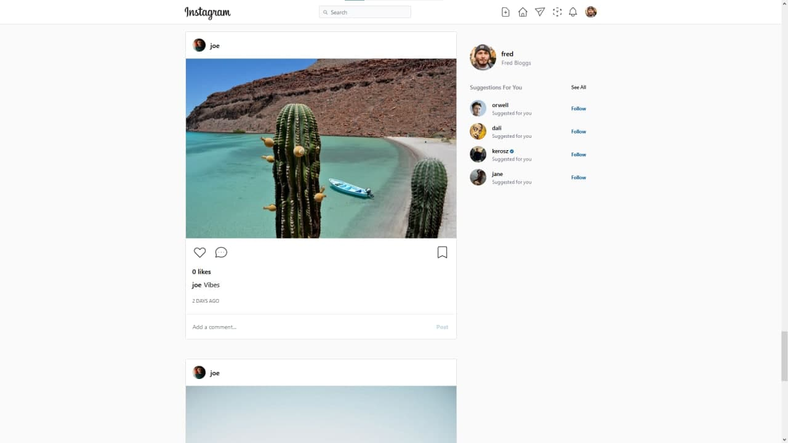

<div align="center">

[](https://github.com/Kerosz/instagram-build)

### Instagram Build

</div>

## Introduction

[](https://github.com/Kerosz/instagram-build/issues)
[](http://chirila.dev)

The application was built with the purpose of using some technologies I have not used before, including fireabase/firestore, firebase/auth and @tailwindcss.

Demo live at: [margatsni.vercel.app](https://margatsni.vercel.app/)

## Features

- Signin/signup
- Forgot password
- Reset password
- Email verification
- Profile page ( for logged in users and non-logged in users with restrictions )
- Post page ( for logged in users and non-logged in users with restrictions)
- Inbox ( direct messages/multi-user-chat-room/chat-details)
- Live notifications
- Settings ( edit-profile/change-password/notification-settings/privacy-and-security)
- Timeline
- Suggestions
- Search
- Explore posts
- Add/delete posts
- Comment/like/save posts

## Codebase

### Technologies

The entire codebase consists in **Javascript**

Here is a list of technologies used:

- **React**: Front-end framework
- **Tailwind**: CSS framework
- **Firebase**: Cloud database/auth provider
- **Cloudinary**: Cloud image management

### Folder structure

```sh
instagram/
├── components     # Reusabble parts
├── constants      # Constant app data
├── context        # Global state layer
├── helpers        # Utility functions
├── hooks          # React custom hooks
├── lib            # External helpers
├── services       # External services / network calls
├── styles         # General app styles
└── pages          # Application views
```

## Acknowledgments

This project is mimicking the famous [Instabram by Facebook](https://www.instagram.com/) web application with no intent of realeasing or advertising the use of the content in this repo. Being just a demo app!!!

Project was built on top of [@karlhadwen](https://github.com/karlhadwen)'s base instagram build, with addition of new features and code changes.
